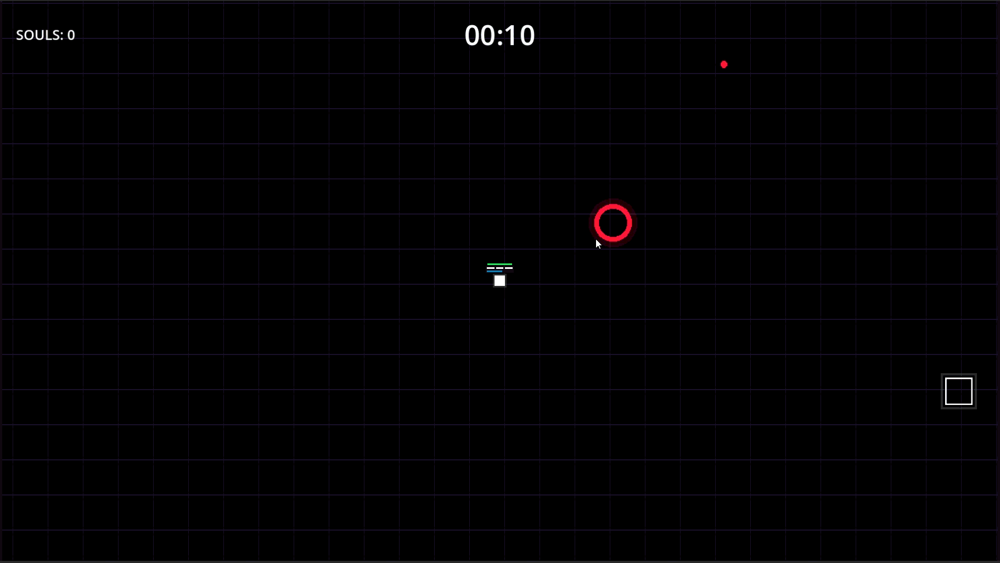

# 🌑 Ink & Void



A high-octane, twin-stick arena roguelite built with a fully custom **Entity-Component-System (ECS)** architecture in Godot 4. 

Survive brutalist bullet-hell anomalies, master the Quicksilver Dash, and perfectly parry enemy projectiles to trigger devastating kinetic ricochets. Harvest the Souls of fallen enemies to purchase permanent meta-progression perks in the Lobby.

Designed for PC and engineered for a future commercial Android release.

## 🚀 Key Gameplay Features

* **Kinematic Parry System:** Slashing an enemy projectile micro-freezes time (Hitstop), flips its faction, and violently redirects it into the nearest enemy with a Chain Ricochet effect. 
* **Quicksilver Dash:** Phase through solid walls of projectiles with i-frames.
* **Predictive AI:** Enemies don't just shoot where you are—Sniper archetypes calculate your velocity vector and travel time to shoot where you *will* be.
* **Meta-Progression Economy:** Collect visually tweened Soul particles dropped by enemies to purchase permanent upgrades (e.g., *Iron Skin*, *Void Battery*, *Kinetic Soles*) at the Lobby Terminal.
* **Interactive Director Tutorial:** A state-machine-driven "Simulation" room that forces players to physically execute dashes and parries to prove their mastery before entering the arena.

## 🛠️ Technical Architecture

This project bypasses standard Godot node inheritance in favor of a highly optimized, data-oriented **Entity-Component-System (ECS)**.

* **Pure Decoupling:** Data (Components like `VelocityData`, `HealthData`) is strictly separated from Logic (Systems like `MovementSystem`, `ImpactSystem`). 
* **Dynamic White-Box Rendering:** Texture memory footprint is slashed in half. All entity geometries are procedurally baked as pure `Color.WHITE` canvases at runtime, with dynamic colors injected via `modulate`. 
* **Event-Driven Event Bus:** UI elements, screen shakes, hit-stops, and damage calculations communicate entirely through a deferred `EventsManager`, preventing spaghetti code and race conditions.
* **GPU-Instanced Splatter Physics:** Uses a multi-mesh ring buffer to paint thousands of permanent, dynamically colored blood droplets onto the arena floor without lagging the CPU.

## 🎮 Controls

The game relies on twin-stick parity, ensuring the combat loop feels native whether using a keyboard or a future mobile touch-joystick.

| Action | PC (Keyboard & Mouse) | Mobile (Planned) |
| :--- | :--- | :--- |
| **Move** | `W` `A` `S` `D` | Left Virtual Joystick |
| **Aim** | Mouse Cursor | Right Virtual Joystick |
| **Slash / Parry** | `Left Click` | Dedicated Action Button |
| **Quicksilver Dash**| `Spacebar` | Dedicated Action Button |
| **Interact** | `E` / Hover | Contextual Tap |

## 🏗️ Project Structure

```text
ink-void/
├── AutoLoads/        # Global Singletons (Cache, MetaEconomy, Factories)
├── Resources/        # ECS Data Components (TransformData, HealthData, etc.)
├── Scenes/           # Visual renderers and UI Managers (World, ShopUI)
└── Systems/          # ECS Logic (MovementSystem, AI, Stalking, Impact)

```

## ⚙️ Installation & Setup

1. Clone the repository.
2. Ensure you have **Godot Engine 4.2+** installed.
3. Import the `project.godot` file via the Project Manager.
4. Hit `F5` to launch into the Main Menu Lobby.
5. Approach the **[ SIMULATION ]** terminal to calibrate your controls.
